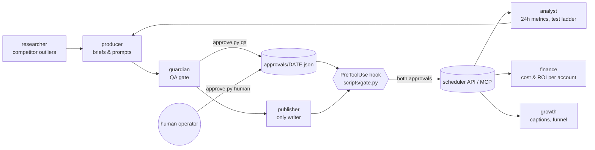

# Architecture

## Why it is built this way

| Decision | Reason |
|---|---|
| Each agent is a Markdown file in `.claude/agents/` | Roles are versioned, diffable and reviewable like code. |
| Write tools are denied to every agent except the publisher | Least privilege: a research or analytics agent cannot publish by mistake. |
| The two-approval rule is a **hook**, not a prompt instruction | A model can be persuaded; an exit code cannot. |
| Per-agent `INBOX.md` / `BOARD.md` | The human leaves instructions asynchronously; each agent leaves an audit trail. |
| `status.py` writes a status light | The operator sees who is working, waiting on a decision, or blocked without reading logs. |
| Certainty labels `[V]/[S]/[?]` | Stops inferences from hardening into "facts" as they pass between agents. |

## Extending it

1. Copy any file in `.claude/agents/`, change `name`/`description` and the body.
2. Add a room: `office/rooms/<name>/INBOX.md` and `BOARD.md`.
3. Add a task to `daily_round` in `office/team.json`.
4. Guard another tool: add a regex to `guarded_tool_patterns` in `office/gate.json`.
